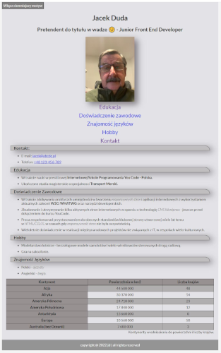

# Jacek Duda - my website

## DEMO

https://jacekdu.github.io/homepage/

## Description:

This is the result of my participation in the course at [YouCode - Internet Programming School](https://youcode.pl).

The website is constantly improved with the knowledge and skills acquired on an ongoing basis during the course and is not the final version as yet.

The top-left corner button toggles background color.

So far in Polish only.

## Tools utilised:

- HTML - Living Standard,
- CSS,
- Javascript - ECMAScript 2020,
- BEM convention,
- Normalise.css,
- The Open Graph Protocol.